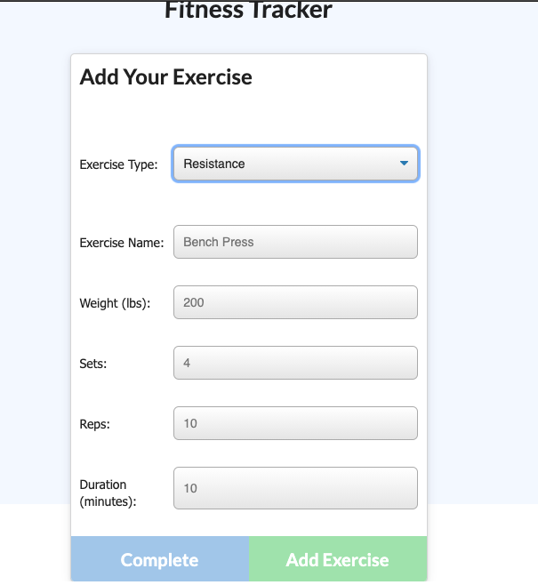
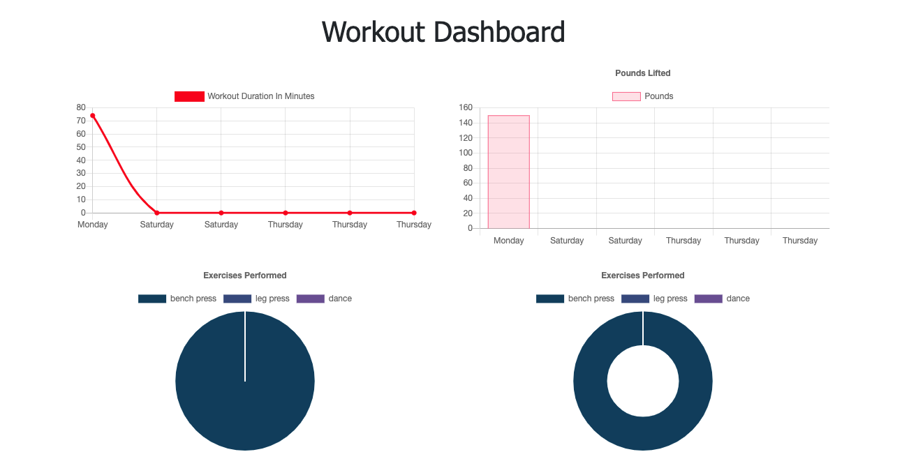
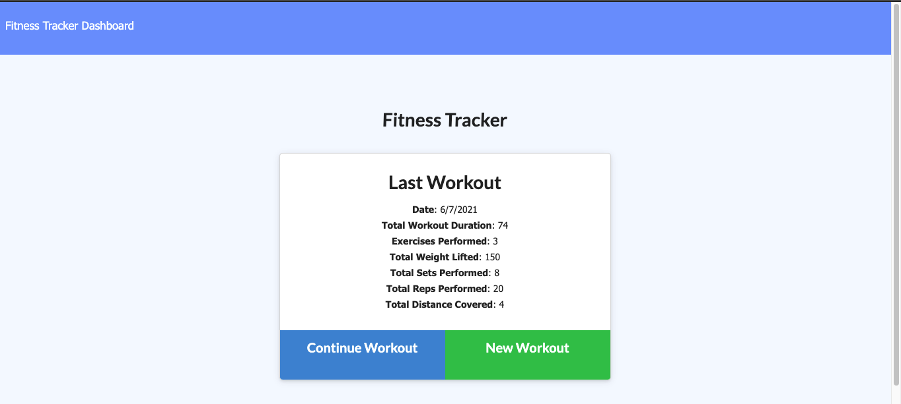

# Workout Tracker

## Table of Contents
* [Description](#description)
* [Technology](#technology)
* [Screenshots](#screenshots)
* [Demonstration](#demonstration)

## Description
This workout tracker is a full stack application designed for the user to view, create and track their daily workout.  Exercises can be added to the most recent workout plan or add to a new workout.  The dashboard displays stats (duraation of each workout and combined weight of multiple exercises) from the last seven workout days.

### [Click this link to view the deployed application] (https://) 

## Technology
* JavaScript
* Node.js
* Express.js
* MongoDB
* Mongoose ODM
* Morgan.js
* Chart.js

## Screenshots

## Demonstration

